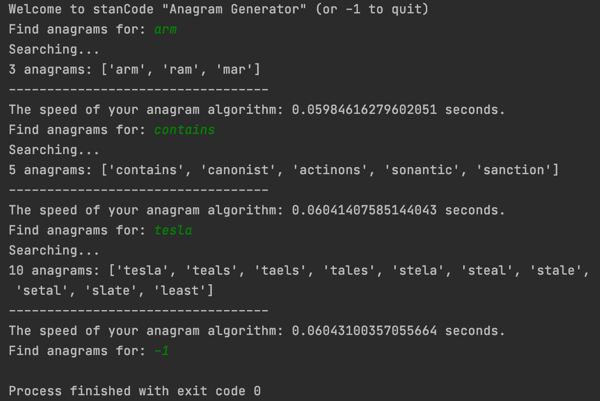

## Main stanCode Projects
Hello there!
This repository holds my main programming projects done during the period of stanCode SC001, SC101, and SC201 courses.

## Project Snapshots 
### SC001
- 🧮 Prime Checker
    - Overview: This program asks our user for input and checks if the input is a
prime number or not.
    - Skills Practice: python semantics & syntax

    

- ☀️ Weather Master
    - Overview: This program should implement a console program
that asks weather data from users to compute the
average, highest, lowest, and cold days among the inputs.
    - Skills Practice: python semantics & syntax

- 💀 Hangman Game
    - Overview: This program plays hangman game.
    - Skills Practice: python semantics & syntax

- 📷︎ MyPhotoshop 
    - Overview: This program creates a photoshopped image.
    - Skills Practice: image processing

### SC101
- 🧱 Breakout Game 
    - Overview: This program executes breakout game.
    - Skills Practice: animation & game designing

- 📈 Name Popularity Searching System 
    - Overview: This program plots out the popularity trend of the names input by users.
    - Skills Practice: data structure

- 👶 Birth Population Calculation
    - Overview: This program collects data from SSA and counts the birth population of the top 200 males and females. 
    - Skills Practice: web crawler & data structure 

- 🔠 Anagrams Searching System
    - Overview: This program finds all the anagram(s) for the word input by users.
    - Skills Practice: recursive functions 

### SC201
- 🍅 Rotten Tomato Review Prediction
    - Overview: This program predicts the reviews input by 
users on Console.
    - Skills Practice: machine learning 

- 🛳︎ Titanic Prediction_Machine Learning Version
    - Overview: This file builds a machine learning algorithm using Pandas and Sklearn libraries.
    - Skills Practice: machine learning 

- 🚢 Titanic Prediction_Deep Neural Net Version
    - Overview: This file demonstrates how to create a deep
neural network (5 layers NN) to train the classic
titanic data.
    - Skills Practice: deep learning 

